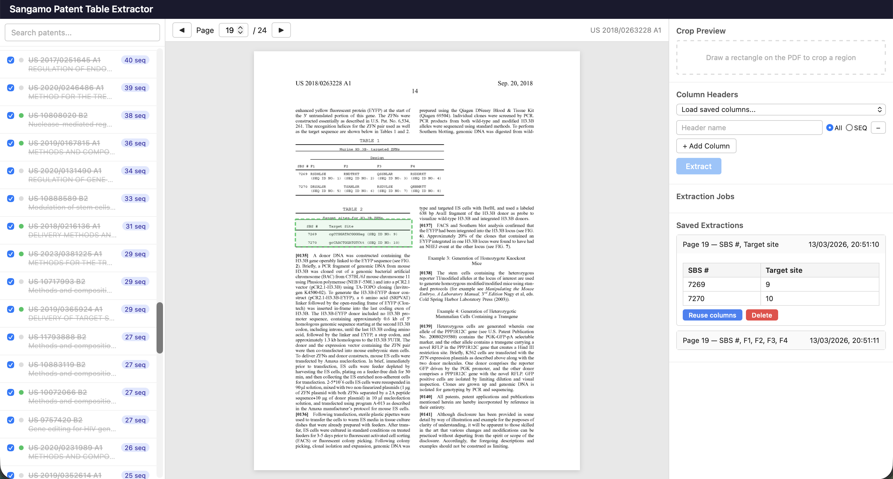

# opensangamo

A web app for extracting structured data from tables in Sangamo Therapeutics patent PDFs. Browse downloaded patents, view pages, crop regions of interest, define column headers, and run LLM-powered extraction to pull table contents into structured form.

## Data

- data/lens-export.csv was downloaded from https://www.lens.org/lens/search/patent/list?p=3&n=10&s=sequence.count&d=%2B&f=true&e=false&l=en&authorField=author&dateFilterField=publishedDate&orderBy=%2Bsequence.count&presentation=false&preview=true&stemmed=true&useAuthorId=false&j.must=US&applicant.must=SANGAMO%20THERAPEUTICS%20INC
